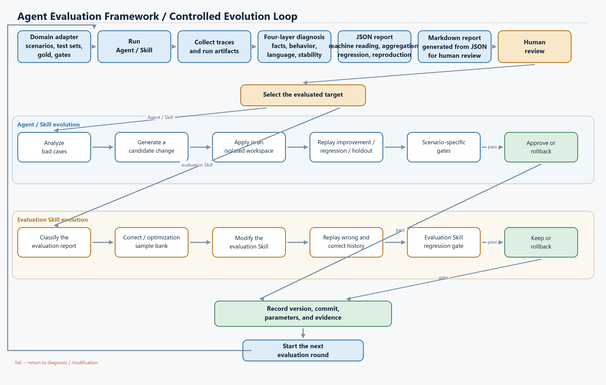

# Agent Evaluation Framework

[中文](README.md) | [English](README.en.md)

A domain-independent framework for automated Agent evaluation, diagnosis, human review, regression testing, and version evolution. It is primarily for validating candidate versions of Agents and Skills before they go live, helping engineering teams move changes from testing to release decisions. Fresh runs, traces, and human feedback from a live system can also feed the next iteration, while the framework never modifies or replaces the production version automatically; the business team remains responsible for release decisions.

This project is for enterprise teams that need to evaluate, diagnose, regression-test, and control the evolution of AI systems.

See [BENCHMARK_RESULTS.en.md](BENCHMARK_RESULTS.en.md) for the published results, the claims those results support, and the commands needed to reproduce them.

## Project flow



[Mermaid source](docs/project-flow.en.mmd)

In the diagram, the JSON report is the structured source for machine reading, aggregation, regression, and reproduction. The Markdown report is generated from JSON for human review.

## License

This is a source-available project for noncommercial research, study, testing, modification, and redistribution. It is not open-source software under the OSI definition. Any distribution of the project, part of its code, or a derivative work must preserve the [PolyForm Noncommercial License 1.0.0](LICENSE) and its `Required Notice`. Commercial use requires written permission from the copyright holder. Contact [linandchpin.2033@gmail.com](mailto:linandchpin.2033@gmail.com) for commercial licensing.

Copyright © 2026 Lin-chpin.

## What a domain integration provides

A domain project exports `ADAPTER = ProjectAdapter(...)` from a Python adapter file with four capabilities.

1. `call_agent(case, context)` calls the Agent through HTTP, an SDK, a subprocess, or a local function.
2. `read_trace(handle, case)` converts the native trace into a `NormalizedTrace`.
3. `hard_gates` defines rules that can block a release.
4. `soft_quality` defines quality checks that only produce warnings and human-review candidates.

Test sets are mounted from outside the framework through `--cases`, `--regression`, `--smoke`, and `--full`. The included `examples/cases.example.jsonl` is only a demonstration and is never loaded by default.

Version evolution runs a baseline adapter and a candidate adapter against the same improvement, regression, and holdout sets. A candidate may come from a person, an external Agent, or any other generation process. The framework verifies version identity, compares results, applies gates, and preserves an audit trail.

`evolve-auto` adds failure diagnosis, text candidate generation, isolated candidate application, and a bounded iteration loop. The domain project still owns the test sets, evaluation rules, and target adapter.

## Separation of responsibilities

```text
Domain adapter: Agent call, native trace conversion, hard gates, soft quality
        ↓
Core evaluation: structure, behavior, consistency, implicit feedback
        ↓
Release flow: run / regression → smoke → full
Evolution flow: baseline ↔ candidate → accept / reject / rollback
        ↓
Supporting services: SQLite, Markdown/JSON, human review, optional LLM, few-shot candidates
```

- Core rules do not depend on the CLI, SQLite, or an LLM.
- An LLM may suggest semantic analysis, likely modules, changes, and few-shot candidates. It never decides a hard gate.
- Human conclusions and automated reports are stored separately.
- Fresh online runs validate the current Agent. Offline traces are only used to recompute scores and diagnoses.
- The framework passes `timeout_seconds` to `call_agent`. HTTP, SDK, and subprocess adapters must cancel timed-out calls themselves. Use a separate process or container when stronger isolation is required.

## Normalized traces

`read_trace` returns a `NormalizedTrace`.

- `trace_id` and `final_output` are integrity fields.
- `events` records `module`, `action`, `status`, `duration_ms`, and `error` for behavioral checks and fault localization.
- `fields` contains structured domain values checked by project rules.
- `feedback` may contain weak signals such as `explicit_negative`, `repeated_question`, and `rephrased`.
- `target_type`, `target_id`, and `target_version` distinguish Agents, ordinary Skills, and evaluator Skills.

The project adapter defines field names and business meaning. The framework only reads declared paths and rules.

## Four evaluation layers

1. **Structure** checks traces, final outputs, declared hard gates, and soft-quality fields.
2. **Behavior** checks step counts, retries, latency, repeated module/action pairs, and module errors.
3. **Consistency** reruns only high-value cases with `consistency_check` enabled. Differences become human-review candidates.
4. **Feedback** treats implicit signals as candidates and never labels them as bad cases automatically.

## Install and run

For integration, acceptance, or deployment, an integrating project can freeze the target version, datasets, Gold, gates, SLOs, and rollback target, then progress through mechanism, system-integration, business, and production acceptance.

```powershell
cd path\to\agent-evaluation-framework
python -m pip install -e .

agent-eval run `
  --adapter examples/project_adapter.py `
  --suite smoke `
  --cases examples/cases.example.jsonl `
  --collect-few-shot
```

A production release evaluates targeted regression cases, the core smoke set, and an optional full set in that order. A hard-gate failure stops the remaining stages.

```powershell
agent-eval release `
  --adapter path/to/project_adapter.py `
  --regression path/to/regression.jsonl `
  --smoke path/to/smoke.jsonl `
  --full path/to/full.jsonl
```

Each result is written to SQLite immediately. Reusing the same `--run-id` with `--resume` skips completed cases.

## General version evolution

`evolve` validates a baseline and a candidate with three datasets. The domain project supplies their content and interpretation.

- `improvement` contains the failures the candidate claims to fix.
- `regression` protects capabilities that have already been confirmed.
- `holdout` contains cases hidden from candidate generation.

```powershell
agent-eval evolve `
  --baseline-adapter examples/evolution_baseline_adapter.py `
  --candidate-adapter examples/evolution_candidate_adapter.py `
  --candidate examples/evolution.candidate.json `
  --policy examples/evolution.policy.json `
  --improvement examples/evolution.improvement.jsonl `
  --regression examples/evolution.regression.jsonl `
  --holdout examples/evolution.holdout.jsonl `
  --experiment-id example-evolution
```

The candidate manifest records the target type, target ID, baseline version, candidate version, change type, and artifact path. `change_type` may represent `prompt`, `skill`, `few-shot`, `tool-policy`, `rag-config`, `output-schema`, `code`, or a domain-specific change.

A policy may constrain regression, holdout, and numeric objectives. Objectives may use `hard_pass`, `soft_warning_count`, `latency_ms`, and `steps`, or read business values from standard result paths. Supported aggregations are `mean`, `sum`, `min`, and `max`, with limits for regression and minimum improvement.

`scenario_gates` can set an independent minimum sample count, pass rate, and regression allowance for high-risk or small scenarios. Unconfigured scenarios still use the aggregate policy, while configured scenarios cannot be hidden by the overall average. See the [scenario-gate policy example](examples/evolution.scenario-policy.example.json).

Decisions have fixed meanings.

- `accept` means the target problem improved measurably without exceeding the permitted regression on protected sets.
- `reject` means the candidate failed to produce its claimed improvement.
- `rollback` means the candidate broke regression, holdout, version identity, or a required metric.

Every experiment saves baseline and candidate results, `evolution.json`, `evolution_report.md`, and the SQLite audit record. Domain owners keep control of business rules and release permissions. External Agents may generate candidates, while deterministic gates verify whether they may advance.

## Automated evolution for text artifacts

An automated-evolution adapter exports `AUTO_EVOLUTION = AutoEvolutionAdapter(...)` and supplies a baseline text artifact, a diagnoser, a candidate generator, and a function that builds a runtime adapter from an artifact.

The deterministic example first proposes a candidate that breaks the holdout set, then a candidate that preserves the baseline. The framework rolls back the first candidate and accepts the second.

```powershell
agent-eval evolve-auto `
  --auto-adapter examples/auto_evolution_adapter.py `
  --policy examples/evolution.policy.json `
  --improvement examples/evolution.improvement.jsonl `
  --regression examples/evolution.regression.jsonl `
  --holdout examples/evolution.holdout.jsonl `
  --max-rounds 1 `
  --max-candidates-per-round 2 `
  --max-elapsed-seconds 300 `
  --max-evolver-calls 4 `
  --loop-id router-evolution-v1
```

`TextArtifactWorkspace` stores baseline snapshots and candidate artifacts under `.agent-eval/workspaces`, protecting domain-project files. A baseline may be one text file or a directory of UTF-8 text files. Multi-file candidates may keep using the compatible `TextCandidate.files` complete-content mapping, or use `TextCandidate.operations` with bounded `write`, `delete`, and `move` operations. Paths must be forward-slash relative file paths. For a directory baseline, the OpenAI-compatible Evolver emits the same operation protocol without a custom multi-file generator. The framework copies the isolated directory, applies the operations, and records a directory hash. Accepted candidates then move to the external release process.

The loop atomically writes `.agent-eval/workspaces/<loop-id>/checkpoint.json`. After an exception or budget stop, fix the external failure or raise the budget and reuse the same parameters with `--resume`. Completed cases are loaded from SQLite, and identical staged candidates are reused. Ordinary evaluation runs persist case identity hashes; resume rejects removed or changed historical cases and permits only append-only additions. The adapter, suite, source, and stable execution configuration must also match. The elapsed-time budget is checked between stages and does not kill a domain call already in progress. `--timeout` and the domain adapter still control individual calls.

`--max-evolver-calls` counts diagnoser and candidate-generator calls. It is not a proxy for tested-Agent tokens or vendor cost. Domain Agent cost should enter the evaluation policy through custom trace metrics.

### Code Agents

Code candidates use `change_type: code`, and a domain adapter may launch them with `run_agent_process`. Candidate files remain in a separate working directory. The runner captures stdout and stderr, applies the explicit working directory, and terminates the process tree after a timeout. Each stream keeps at most 1 MiB by default; exceeding the limit immediately terminates the process tree and raises `OutputLimitExceeded`. Adapters can change the limit with `max_output_bytes`. Escaping or conflicting file operations are rejected before candidate copying, and rollback never overwrites the baseline directory.

```powershell
agent-eval evolve-auto `
  --auto-adapter examples/code_auto_evolution_adapter.py `
  --policy examples/evolution.policy.json `
  --improvement examples/evolution.improvement.jsonl `
  --regression examples/evolution.regression.jsonl `
  --holdout examples/evolution.holdout.jsonl `
  --max-rounds 1 `
  --max-candidates-per-round 2
```

Code execution can choose the process runner or `run_agent_container` by trust level. Docker and Podman defaults disable networking, mount the candidate workspace read-only, use a read-only container filesystem, drop capabilities, and limit CPU, memory, and PIDs, giving candidate execution clear resource and permission boundaries.

Linux GitHub Actions starts a real Docker container and verifies a read-only workspace, a read-only root filesystem, disabled networking, and writable `/tmp`. It uploads `container-smoke.json` with the image RepoDigest, so the container evidence does not stop at command-construction tests.

```python
from agent_eval import run_agent_container

result = run_agent_container(
    "python:3.12",
    ["python", "agent.py"],
    candidate_directory,
    timeout_seconds=60,
)
```

For model-generated diagnoses and candidates, an adapter can use `OpenAICompatibleTextEvolver.diagnose` and `generate_candidates`. It reads `AGENT_EVAL_MODEL`, `AGENT_EVAL_BASE_URL`, and `AGENT_EVAL_API_KEY`, using improvement evidence and the current text to produce candidates while keeping regression and holdout independent. Deterministic gates verify every candidate and produce the acceptance or rollback decision.

## Private reference-system result

The framework was integrated with an external Agent system that is not distributed in this repository. Its real HTTP interface, version switching, and traces were used in a Prompt-evolution run. One mechanism run moved improvement, regression, and holdout hard-pass rates from 25%, 100%, and 75% to 100%, 100%, and 100%, respectively, with acceptance limited to the framework workspace. The public repository keeps aggregate results only. It does not include the private system's source, Prompt, business cases, adapter, or executable reproduction material. Core mechanics remain independently reproducible through the generic deterministic tasks and CI in this repository.

## Case format

```json
{
  "id": "CASE-001",
  "scenario": "routing",
  "input": {"message": "..."},
  "expected": {"route": "TARGET", "keyword": "..."},
  "metadata": {
    "consistency_check": true,
    "consistency_runs": 2,
    "system_constraints": {
      "max_steps": 12,
      "max_retries": 1,
      "max_latency_ms": 30000
    }
  }
}
```

Expected fields and their rules belong to the project adapter. The framework has no built-in meaning for medical workflows, routing, RAG, or tool calls.

## Review and evolution artifacts

Each run produces the following files.

- `results.json` contains per-case facts, rule outcomes, and traces.
- `report.md` contains hard failures, soft warnings, scenario distribution, and likely modules.
- `scenario_stats.json` groups sample counts, pass rates, and 95% confidence intervals by scenario and `targetType/targetId`.
- `review_queue.jsonl` contains reports awaiting human confirmation.
- `few_shot_candidates.jsonl` contains successful paths that passed every gate and quality check.

Each `evolve` run also produces the following files.

- `evolution.json` contains the candidate, policy, three dataset results, and final decision.
- `evolution_report.md` compares hard passes, warnings, latency, custom objectives, and version lineage.

Each `evolve-auto` run adds two more files.

- `auto_evolution.json` records diagnoses, candidates, evaluations, and the final isolated version for every round.
- `auto_evolution_report.md` records acceptance, rejection, rollback, and the stopping reason.

Human conclusions are stored in SQLite.

```powershell
agent-eval review `
  --run-id RUN_ID `
  --case-id CASE_ID `
  --decision confirmed_badcase `
  --conclusion "Human-confirmed root cause"
```

Maintainers add confirmed bad cases to the domain regression set. Few-shot candidates must be redacted, deduplicated, reviewed, and tied to a specific Skill version before use. The framework only exports candidates and never modifies domain-project files automatically.

```powershell
agent-eval export --kind regression --output regression.candidates.jsonl
agent-eval export --kind few-shot --output few-shot.accepted.jsonl
```

The domain maintainer decides when to merge exported candidates, create a new version, and run regression evaluation.

Evaluator Skills use a separate promotion flow for human-reviewed samples. A business gold that cannot be confirmed must remain `pending` and cannot enter a formal gate.

```powershell
agent-eval promote-review `
  --input review-sample.json `
  --outcome UNRESOLVED `
  --role pending `
  --conclusion "The business owner cannot adjudicate this case yet" `
  --reviewer "business-owner" `
  --output pending-reviews.jsonl
```

After adjudication, the same record can be promoted to improvement, regression, or holdout. `review_history` preserves both the initial judgment and the final decision.

## Optional LLM support

Deterministic evaluation, reporting, human review, and regression work without an LLM. Configure these variables only when semantic analysis is needed.

```powershell
$env:AGENT_EVAL_MODEL = "your-model"
$env:AGENT_EVAL_BASE_URL = "https://provider.example/v1"
$env:AGENT_EVAL_API_KEY = "..."
```

Add `--use-llm` at runtime. LLM output is always labeled as non-authoritative advice.

## Verification

```powershell
python -m unittest discover -s tests -v
```

Read [CONTRIBUTING.en.md](CONTRIBUTING.en.md) before contributing. Follow [SECURITY.en.md](SECURITY.en.md) when reporting a vulnerability.
