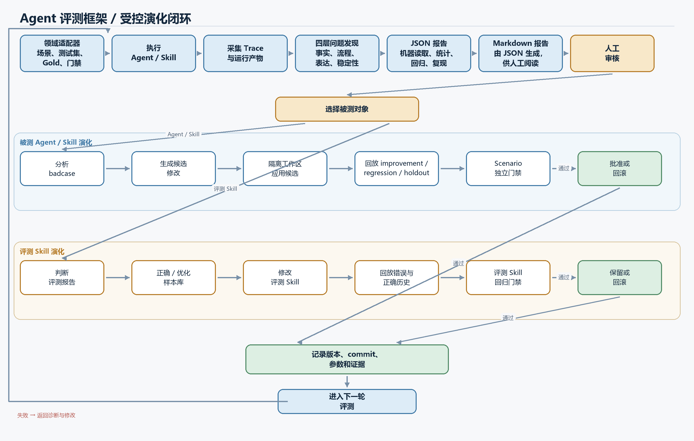

# Agent Evaluation Framework

[中文](README.md) | [English](README.en.md)

一个与领域解耦的 Agent 自动评测、诊断、人工审核、回归和版本演化框架。它主要用于 Agent 和 Skill 上线前的候选版本验证，帮助研发团队把改动从测试验证推进到发布决策。线上系统产生的 fresh run、Trace 和人工反馈也可以回流到下一轮迭代，但框架不会自动修改或替换生产版本，发布权限仍由业务方掌握。

本项目面向需要评测、诊断、回归验证和受控演化 AI 系统的企业级研发团队。

公开测试结果、可支持的结论和一键复现方式见 [BENCHMARK_RESULTS.md](BENCHMARK_RESULTS.md)。

## 项目流程



[Mermaid 源码](docs/project-flow.zh-CN.mmd)

图中的 JSON 报告是机器读取、统计、回归和复现的结构化事实源，Markdown 报告由 JSON 生成，供人工阅读。

## 使用许可

本项目源码公开，供非商业研究、学习、测试、修改和分发使用，不属于 OSI 定义的开源软件。分发原项目、部分代码或衍生作品时，必须保留 [PolyForm Noncommercial License 1.0.0](LICENSE) 及其中的 `Required Notice`。商业使用需要取得版权所有者的书面授权，联系邮箱为 [linandchpin.2033@gmail.com](mailto:linandchpin.2033@gmail.com)。

Copyright © 2026 Lin-chpin。

## 领域项目只提供四项能力

领域项目通过一个 Python 适配文件导出 `ADAPTER = ProjectAdapter(...)`：

1. `call_agent(case, context)`：通过 HTTP、SDK、子进程或本地函数调用 Agent。
2. `read_trace(handle, case)`：把原生 Trace 转换成 `NormalizedTrace`。
3. `hard_gates`：发布阻断规则。
4. `soft_quality`：只产生质量告警和人工复核候选的规则。

测试集通过 `--cases`、`--regression`、`--smoke` 和 `--full` 外部挂载。仓库中的 `examples/cases.example.jsonl` 只用于演示，不会被框架默认加载。

版本演化使用基线适配器和候选适配器运行同一批 improvement、regression 和 holdout 数据。候选可以来自人工、外部 Agent 或任何生成流程，框架统一负责版本识别、效果比较、门禁决策和审计记录。

`evolve-auto` 在此基础上增加失败诊断、文本候选生成、沙箱应用和有限轮次自动迭代。领域项目仍然提供测试集、评价规则和目标适配器。

## 解耦边界

```text
领域适配层：Agent 调用、原生 Trace 转换、硬门禁、软质量
        ↓
核心评测层：结构、行为、一致性、隐式反馈
        ↓
流程编排层：run / regression → smoke → full
演化编排层：baseline ↔ candidate → accept / reject / rollback
        ↓
外围能力：SQLite、Markdown/JSON、人工审核、可选 LLM、few-shot 候选
```

- 核心规则不依赖 CLI、SQLite 或 LLM。
- LLM 只生成语义分析、疑似模块、修改建议和 few-shot 候选，不参与硬门禁判定。
- 人工最终结论与自动报告分开保存。
- 在线 fresh run 用于验证当前 Agent；离线 Trace 只用于重新计算评分和诊断。
- 框架把 `timeout_seconds` 传给 `call_agent`；HTTP、SDK 或子进程适配器负责真正取消超时调用。需要强隔离时再把 Runner 放入独立进程或容器。

## 标准 Trace

`read_trace` 应返回 `NormalizedTrace`，其中：

- `trace_id` 和 `final_output` 是框架完整性字段。
- `events` 保存 `module`、`action`、`status`、`duration_ms` 和 `error`，供行为异常和模块定位使用。
- `fields` 保存领域项目希望用规则检查的结构化结果。
- `feedback` 可保存 `explicit_negative`、`repeated_question`、`rephrased` 等弱信号。
- `target_type`、`target_id`、`target_version` 用于区分 Agent、普通 Skill 和测评 Skill。

字段命名和业务含义由项目适配层决定，框架只读取路径和规则。

## 四层评测

1. **结构层**：Trace、最终输出及项目声明的硬门禁和软质量字段。
2. **行为层**：步骤数、重试、延迟、重复 module/action 和模块错误。
3. **一致性层**：仅对 case 中启用 `consistency_check` 的高价值节点执行多次运行；差异只进入人工复核候选。
4. **反馈层**：隐式反馈只生成候选，不自动判定 badcase。

## 安装与运行

业务项目接入、验收或上线时，接入方可以冻结目标版本、数据集、Gold、门禁、SLO 和回滚目标，按机制验收、系统集成、业务验收和生产验收逐步推进。

```powershell
cd path\to\agent-evaluation-framework
python -m pip install -e .

agent-eval run `
  --adapter examples/project_adapter.py `
  --suite smoke `
  --cases examples/cases.example.jsonl `
  --collect-few-shot
```

生产发布评测固定按照针对性 regression、核心 smoke、可选 full 执行。任一阶段出现硬门禁失败，后续阶段停止：

```powershell
agent-eval release `
  --adapter path/to/project_adapter.py `
  --regression path/to/regression.jsonl `
  --smoke path/to/smoke.jsonl `
  --full path/to/full.jsonl
```

每条结果会立即写入 SQLite。使用相同 `--run-id --resume` 可以跳过已经完成的 case。

## 根据 Git diff 选择测试集

`select-tests` 通过规则、AI 和人工三层判断当前未提交改动应跑哪套测试。确定性规则提供安全底线，AI 阅读改动判断真实影响范围，人工只复核低置信度、规则与 AI 冲突以及高风险变更。AI 不能把规则要求的测试强度降级。

- `smoke`：文档、UI 和报告展示等低风险改动。
- `regression`：Planner、Prompt、安全规则、追问策略、质检逻辑和一般行为改动。
- `full`：生成、RAG/检索、Agent 核心逻辑或评测结果结构改动。

```powershell
# 不调用模型，只使用确定性规则
agent-eval select-tests --repository path/to/domain-project

# 本地部署模型默认读取完整 diff，不需要脱敏
$env:AGENT_EVAL_MODEL = "local-model"
$env:AGENT_EVAL_BASE_URL = "http://127.0.0.1:11434/v1"
agent-eval select-tests --repository path/to/domain-project --ai-provider local

# 第三方 API 强制只接收脱敏摘要
agent-eval select-tests --repository path/to/domain-project --ai-provider remote
```

本地模式只接受回环地址、私有 IP 或 `.local` 地址，默认发送完整 diff；也可以追加 `--ai-input summary` 主动只使用摘要。远程模式不允许 `--ai-input raw`，发送的摘要只包含文件数量、扩展名、改动行数、文件类别和通用影响信号，不包含源码、文件路径、URL 或具体值。完整边界见 [测试集自动选择](docs/test-selection.md)。

## 通用版本演化

`evolve` 同时验证基线版本和候选版本。三个数据集职责固定，内容和业务口径由领域项目提供：

- `improvement`：候选版本声称要改善的问题。
- `regression`：已经确认、不能复发的历史能力。
- `holdout`：候选生成过程没有使用的留出样本。

```powershell
agent-eval evolve `
  --baseline-adapter examples/evolution_baseline_adapter.py `
  --candidate-adapter examples/evolution_candidate_adapter.py `
  --candidate examples/evolution.candidate.json `
  --policy examples/evolution.policy.json `
  --improvement examples/evolution.improvement.jsonl `
  --regression examples/evolution.regression.jsonl `
  --holdout examples/evolution.holdout.jsonl `
  --experiment-id example-evolution
```

候选清单记录目标类型、目标 ID、基线版本、候选版本、变更类型和产物位置。`change_type` 可以表示 `prompt`、`skill`、`few-shot`、`tool-policy`、`rag-config`、`output-schema` 或领域自定义类型。

策略文件可以约束 regression、holdout 和数值目标。目标可以直接使用 `hard_pass`、`soft_warning_count`、`latency_ms`、`steps`，也可以从标准结果路径读取业务字段；支持 `mean`、`sum`、`min` 和 `max` 聚合，以及最大允许退化和最低改善幅度。

`scenario_gates` 可以为高风险或小样本场景单独设置最低样本数、最低通过率和允许退化。未配置的场景继续服从整体门禁，已配置场景不会被全量平均值掩盖。示例见 [场景门禁策略](examples/evolution.scenario-policy.example.json)。

决策含义：

- `accept`：目标问题获得可测量改善，且保护集没有超过策略允许的退化。
- `reject`：候选没有达到声明的改善目标。
- `rollback`：候选破坏 regression、holdout、版本身份或必要指标。

每次演化会保存完整的基线与候选运行结果、`evolution.json`、`evolution_report.md` 和 SQLite 审计记录。业务方掌握业务规则和发布权限，外部 Agent 可以生成候选，框架负责验证候选是否达到要求并决定它能否进入下一阶段。

## 文本型自动演化

自动演化适配器导出 `AUTO_EVOLUTION = AutoEvolutionAdapter(...)`，并提供基线文本产物、诊断器、候选生成器和根据产物创建运行适配器的函数。

仓库中的确定性示例会先生成一个破坏留出集的候选，再生成一个保留基线能力的候选。框架应当回滚前者并接受后者。

```powershell
agent-eval evolve-auto `
  --auto-adapter examples/auto_evolution_adapter.py `
  --policy examples/evolution.policy.json `
  --improvement examples/evolution.improvement.jsonl `
  --regression examples/evolution.regression.jsonl `
  --holdout examples/evolution.holdout.jsonl `
  --max-rounds 1 `
  --max-candidates-per-round 2 `
  --max-elapsed-seconds 300 `
  --max-evolver-calls 4 `
  --loop-id router-evolution-v1
```

`TextArtifactWorkspace` 在 `.agent-eval/workspaces` 中保存基线快照和候选产物，保护领域项目原文件。基线可以是单个文本文件，也可以是 UTF-8 文本仓库目录。多文件候选可以通过兼容字段 `TextCandidate.files` 写入完整内容，也可以通过 `TextCandidate.operations` 执行受限的 `write`、`delete` 和 `move`；路径必须是使用 `/` 的相对文件路径。OpenAI-compatible Evolver 遇到目录基线时会直接生成同一操作协议，无需另写多文件生成适配器。框架复制当前沙箱目录后再应用变更并保存目录哈希，候选通过后进入外部发布流程。

循环会原子写入 `.agent-eval/workspaces/<loop-id>/checkpoint.json`。异常、时间预算或生成调用预算中止后，可以提高预算或修复外部故障，再使用相同参数追加 `--resume`；已完成的 case 从 SQLite 读取，内容相同的已暂存候选会直接复用。普通评测运行会保存 case 身份哈希，恢复时拒绝缺失或内容改变的历史 case，只允许追加新 case；适配器、suite、source 和稳定执行配置也必须保持一致。时间预算在阶段边界检查，不会强杀正在执行的领域调用；单次调用仍由 `--timeout` 和领域适配器负责。

`--max-evolver-calls` 统计诊断器和候选生成器的调用次数。它不冒充被测 Agent 的 token 或供应商账单；业务 Agent 的模型成本应通过 Trace 自定义指标进入评测策略。

### 代码型 Agent

代码候选可以把 `change_type` 设为 `code`，并由领域适配器使用 `run_agent_process` 启动。候选文件仍由 `TextArtifactWorkspace` 放进独立目录，进程以该目录为工作目录运行，超时会终止进程树并保留 stdout/stderr。每个输出流默认最多保留 1 MiB；一旦超限，框架立即终止进程树并抛出 `OutputLimitExceeded`，上限可以通过 `max_output_bytes` 调整。越界或冲突文件操作会在复制候选前被拒绝，回滚候选不会覆盖基线目录。

```powershell
agent-eval evolve-auto `
  --auto-adapter examples/code_auto_evolution_adapter.py `
  --policy examples/evolution.policy.json `
  --improvement examples/evolution.improvement.jsonl `
  --regression examples/evolution.regression.jsonl `
  --holdout examples/evolution.holdout.jsonl `
  --max-rounds 1 `
  --max-candidates-per-round 2
```

代码执行可以按信任等级选择进程 Runner 或 `run_agent_container`。Docker 或 Podman Runner 默认禁用网络、只读挂载候选目录、使用只读容器文件系统、移除 capabilities，并限制 CPU、内存和 PID，为候选执行提供清晰的资源与权限边界。

Linux GitHub Actions 会启动真实 Docker 容器，逐项验证工作区只读、根文件系统只读、网络禁用和 `/tmp` 可写，并上传包含镜像 RepoDigest 的 `container-smoke.json`，因此容器证据不只停留在命令构造测试。

```python
from agent_eval import run_agent_container

result = run_agent_container(
    "python:3.12",
    ["python", "agent.py"],
    candidate_directory,
    timeout_seconds=60,
)
```

需要模型自动诊断和生成候选时，可以在领域适配器中使用 `OpenAICompatibleTextEvolver` 的 `diagnose` 和 `generate_candidates` 方法。它复用 `AGENT_EVAL_MODEL`、`AGENT_EVAL_BASE_URL` 和 `AGENT_EVAL_API_KEY`，围绕改进集失败证据和当前文本生成候选，回归集与留出集保持独立。确定性门禁负责统一验证候选并给出接受或回滚结果。

## 私有参考系统结果

框架曾接入一个不随本仓库公开的外部 Agent 系统，通过其真实 HTTP 接口、版本切换和 Trace 完成 Prompt 演化。一次机制运行中，候选把 improvement、regression、holdout 的硬通过率从 25%、100%、75% 提升或保持到 100%、100%、100%，且只在框架沙箱内接受。公开仓库仅保留聚合结果，不包含该私有项目的源码、Prompt、业务 case、适配器或可执行复现材料；核心机制由仓库内的通用确定性任务和 CI 独立复现。

## Case 格式

```json
{
  "id": "CASE-001",
  "scenario": "routing",
  "input": {"message": "..."},
  "expected": {"route": "TARGET", "keyword": "..."},
  "metadata": {
    "consistency_check": true,
    "consistency_runs": 2,
    "system_constraints": {
      "max_steps": 12,
      "max_retries": 1,
      "max_latency_ms": 30000
    }
  }
}
```

期望字段和规则由项目适配器对应。框架没有医疗、路由、RAG 或工具调用等预设语义。

## 人工审核和自进化产物

每次运行生成：

- `results.json`：逐 case 事实、规则结果和 Trace。
- `report.md`：硬失败、软告警、场景分布和疑似模块。
- `scenario_stats.json`：按场景及 `targetType/targetId` 统计样本量、通过率和 95% 置信区间。
- `review_queue.jsonl`：等待人工确认的报告。
- `few_shot_candidates.jsonl`：通过全部门禁和质量检查的成功路径候选。

每次 `evolve` 额外生成：

- `evolution.json`：候选、策略、三类数据集结果和最终决策。
- `evolution_report.md`：基线与候选的通过率、告警、延迟、自定义目标和版本链路。

每次 `evolve-auto` 额外生成：

- `auto_evolution.json`：每轮诊断、候选、评测结果和最终沙箱版本。
- `auto_evolution_report.md`：候选接受、拒绝、回滚和停止原因。

人工最终结论写入 SQLite：

```powershell
agent-eval review `
  --run-id RUN_ID `
  --case-id CASE_ID `
  --decision confirmed_badcase `
  --conclusion "人工确认的最终原因"
```

确认的 badcase 由维护者写回领域项目的 regression 测试集；few-shot 候选经脱敏、去重和人工审核后再绑定对应 Skill 版本。框架只产出候选，不自动改动领域项目。

人工确认后可以导出，不直接覆盖领域项目文件：

```powershell
agent-eval export --kind regression --output regression.candidates.jsonl
agent-eval export --kind few-shot --output few-shot.accepted.jsonl
```

领域项目维护者决定何时合并导出结果、创建新版本并执行回归。

评测 Skill 的人工审核样本使用独立晋级入口。未能确认的业务 gold 必须留在 `pending`，不能进入正式门禁：

```powershell
agent-eval promote-review `
  --input review-sample.json `
  --outcome UNRESOLVED `
  --role pending `
  --conclusion "业务方暂时无法裁决" `
  --reviewer "business-owner" `
  --output pending-reviews.jsonl
```

复核后可将同一记录晋级到 improvement、regression 或 holdout；`review_history` 会保留首次判断与最终裁决。

## 可选 LLM

不配置 LLM 时，确定性评测、报告、人工审核和回归流程仍可运行。需要语义分析时设置：

```powershell
$env:AGENT_EVAL_MODEL = "your-model"
$env:AGENT_EVAL_BASE_URL = "https://provider.example/v1"
$env:AGENT_EVAL_API_KEY = "..."
```

运行时增加 `--use-llm`。LLM 输出始终标记为非权威建议。

## 验证

```powershell
python -m unittest discover -s tests -v
```

参与开发前请阅读 [CONTRIBUTING.md](CONTRIBUTING.md)；安全问题请按照 [SECURITY.md](SECURITY.md) 私下报告。
